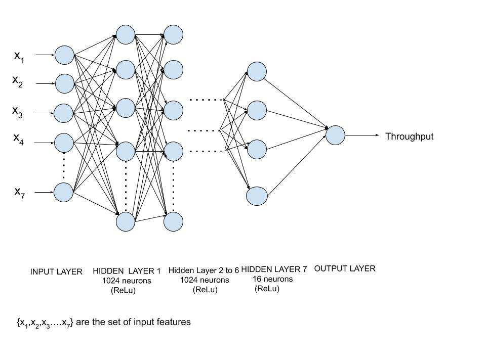

# UPF_ITU_T_5G_ML_AI_Challenge_Net_Intels

Problem Statement: Improving the capacity of IEEE 802.11 WLANs using Machine Learning

Team : Net Intels , PES University , Bangalore, India

Team Members:
- M Rajasekar
- Megha G Kulkarni
- K Venkat Ramnan
- Vishalsagar U

Description:

To address the Channel Bonding problem in WLANs, we propose the application of Machine Learning (e.g., Deep Learning) to predict the performance of an OBSS where different combinations of channel schemes are allocated to the different BSSs. The main purpose is, therefore, to predict the throughput that a BSS would obtain according to the data extracted from simulated deployments generated based on different random parameters, including channel allocation, location of nodes, and number of STAs per BSS.
Performance prediction in WLANs can be used to optimize the planning phase of a given deployment or improve the performance during the operation of a WLAN.

Repository Description:

Contains Python scripts, Jupyter & Google Colab notebooks, text files, CSV files which are used in finding the solution for given problem. The results obtained in the course of challenge are submitted to ITU.
The Documentation Folder contains PDF for the documentation of this project.
The ANN Folder Contains all the data related to the Artificial Neural Network Approach
The Preprocessing Folder contains two subfolders : Training and Testing. Each of these folders contain the respective codes.

Approaches used for solving the problem and corresponding model accuracy for training data:

1.K nearest neigbhors method: implementation of learning based on the k nearest neighbors of each query point,where k is an integer value specified by the user.

  RMSE=6.88 and MAE=4.67
  
2.Random forest regressor : implementation of ensemble technique with use of multiple decesion trees and bagging.

  RMSE=6.91 and MAE=4.88
  
3.Artificial Neural Network : implementation of neural network in order to learn and reduce error during prediction (regression).

 RMSE=3.1 and MAE=2.8

The Neural Network Architecture designed is shown in the figure below:

 
  

